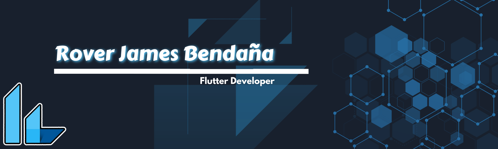

<h1 align="center">Hey there, I'm Rover James 👋</h1>

  🚀 Aspiring Software Developer &nbsp;|&nbsp; 📱 Mobile App Enthusiast &nbsp;|&nbsp; 🎓 BSIT Student  

  
  
  

---

## 👨‍💻 About Me

I'm **Rover James Bendaña**, a dedicated Information Technology student at the **University of Nueva Caceres**, with a passion for **mobile app development** and a strong interest in becoming a full-time software developer.

💡 I enjoy creating clean and intuitive user experiences.  
📱 Currently building apps with **Flutter**, **Android**, **Kotlin**, and **Java**.  
🧠 Always exploring ways to write efficient, scalable, and clean code.

---

## 🛠️ Tech Stack

  
  
  
  
  

---

## 🎓 Education

**Bachelor of Science in Information Technology**  
📍 *University of Nueva Caceres*  
📅 *2025 – Present*

---

## 🤝 Let's Connect

  I'm always open to collaboration, networking, and learning from others in the tech community. Let’s connect!

  <em>“Keep building. Keep learning. Stay curious.”</em>

